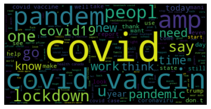

# IR-WA Final Project

#### By Gerard Camps i Romaguera, ID: 193415

___

**About this repository: **

This repository contains the work done for the final project for IR-WA subject at UPF. An overview of the different folders is detailed:

* **data:** This folder contains the data collected plus subsets created in order to test.
* **notebooks: ** The notebooks required for the questions. 
* **search engine: ** python script to be run for task 2, detailed below.
* **tools: **bash scripts to perform basic tasks such as correctly format json documents

____

**How to use:**

1. Clone the repository
2. Run `pipenv install` for installing the dependencies in Pipenv file (or install them manually, but personally I don't like to mess with python's local dependencies )
3. Run pipenv shell to activate the environment or alternatively:
   1. Run `pipenv run [any_file.py] [arg1] [arg2] [argN]` 
   2. For running the notebooks simply `pipenv run python -m "notebook"`

____

**Section 1: Data Collection**
For the data collection, we created a simple script called `scrapper.py`. As Twitter was giving certain errors with large ammounts of collected tweets per run for the same api connection, we decided to run batches of 10k tweets per run, using a bash script to launch the scrapper every time it finished, until we got the desired ammounts of tweets. Finally the dataset collected contains:

* **Entries:** 171018 entries.
* **Original tweets: **58960
* **Retweets: **112058
* **Unique users: ** 130087
* **Unique hashtags: **8046
* **Hashtags written (not unique): **32839

The data was collected between Dec 9 and Dec 10. 

____

**Section 2: Search engine**

In this section we adapted the code provided in class so if fitted our needs. The search engine can be found in the folder `search_engine`. Before deeping into details, a few explanatory tips on how to run the search engine:

To run the program, simply:

```bash
pipenv run python search_engine.py ../data/tweets_collection_v1.json.gz 20
```

Where the arguments follow:

1. Location where the tweet data is stored.
2. The number of results we want to get once the query is done.

The pre-processing strategy is the same followed in the seminar lectures, as can be seen in the code:

```python
		stemming = PorterStemmer()
    stops = set(stopwords.words("english"))
    # Transform in lowercase
    text = text.lower() 
    #Tokenize the text to get a list of terms
    text =  text.split() 
    # eliminate the stopwords 
    text = [token for token in text if token not in stopwords.words('english')]  
    # stem words
    text = [stemming.stem(token) for token in text]
```

The strategy is to:

1. Lowercase the whole text for each tweet.
2. Split the text to a list containing all the terms in the text.
3. Eliminate stopwords from such list.
4. Perform stemming on the remaining tokens.

**WordCloud:**

The wordcloud generated with the dataset is as follows:



**Custom score:**

As the task was to score documents with cosine similarity plus a custom rank based on the popularity of the sources, we decided to take into account the likes and the retweets for each tweet to have a weight on the final score. Similarly to the tf and idf vectors, we create a dictionary for each tweet containing the number of retweets and another vector containing its number of likes. We as well normalize those values, dividing by the maximum ammount of both, so the final score for each tweet follows:

```python
docScores=[ [np.dot(curDocVec, queryVector) + 1.5*rt[doc] + likes[doc], doc] for doc, curDocVec in docVectors.items() ]
```

The fact that we decided to give more weight to retweets than likes is because retweets give more visibility than likes, and hence, make a tweet more popular (bearing in mind that in the recent ~2 years Twitter also shows eventually tweets favorited by the people you follow). As can be seen, the results of using the two different methods are quite different:


The drawbacks of using this method are some. For instance, the search engine will for sure return most liked/retweeted contents even if they are little relevant to the query in terms of words even if we're mesauring cosine similarity with term frequencies. Also, of course, when using as a measure popularity, most viral content will be retrieved, in real life, this means that individuals with better content are not being shown because of the fact that they might not have vitality. 